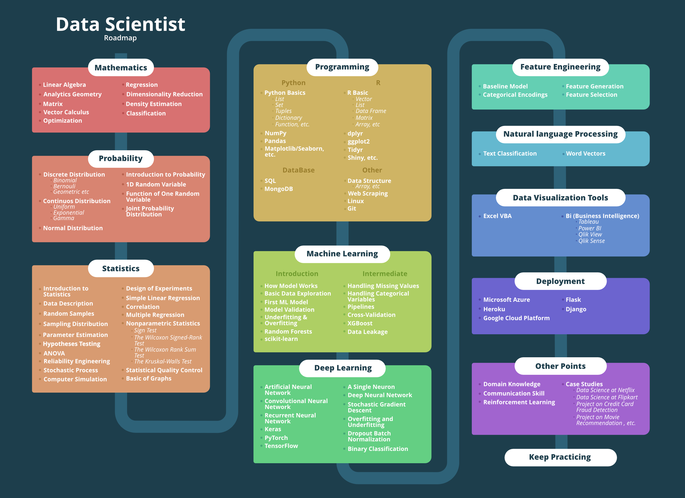

# Data Science RoadMap

---

## 1. Mathematics

### Part 1

| Area              | Source | Status |
| ----------------- | ------ | ------ |
| Linear Algebra    |        |        |
| Analytic Geometry |        |        |
| Matrix            |        |        |
| Vector Calculus   |        |        |
| Optimization      |        |        |

#### Part 2

| Area                     | Source | Status |
| ------------------------ | ------ | ------ |
| Regression               |        |        |
| Dimensionality Reduction |        |        |
| Density Estimation       |        |        |
| Classification           |        |        |

---

## 2. Probability

---

## 3. Statistics

| URL                                      | Title                      | Status    |
| ---------------------------------------- | -------------------------- | --------- |
| [Stepik](https://stepik.org/course/76)   | Основы статистики          | **Done**  |
| [Stepik](https://stepik.org/course/524)  | Основы статистики. Часть 2 | **To do** |
| [Stepik](https://stepik.org/course/2152) | Основы статистики. Часть 3 | **To do** |

---

## 4. Programming

### Python

#### Courses

| URL                                                             | Title                                                      | Status    |
| --------------------------------------------------------------- | ---------------------------------------------------------- | --------- |
| [Stepik](https://stepik.org/course/67)                          | Программирование на Python                                 | **To do** |
| [Stepik](https://stepik.org/course/3356)                        | Практикум по математике и Python                           | **To do** |
| [Udemy](https://www.udemy.com/course/complete-python-bootcamp/) | Complete Python Bootcamp: Go from zero to hero in Python 3 | **To do** |

#### Books

| Title                         | Author         | Status    |
| ----------------------------- | -------------- | --------- |
| Python. К вершинам мастерства | Лучано Рамальо | **To do** |

### R

#### Courses

| URL                                     | Title             | Status    |
| --------------------------------------- | ----------------- | --------- |
| [Stepik](https://stepik.org/course/129) | Анализ данных в R | **To do** |

#### Books

| Title | Author | Status |
| ----- | ------ | ------ |
|       |        |        |

### Scala

#### Courses

| URL                                       | Title            | Status    |
| ----------------------------------------- | ---------------- | --------- |
| [Stepik](https://stepik.org/course/16243) | Введение в Scala | **To do** |

#### Books

| Title                                    | Author                                  | Status    |
| ---------------------------------------- | --------------------------------------- | --------- |
| Scala. Профессиональное программирование | Билл Веннерс, Мартин Одерски, Лекс Спун | **To do** |
| Scala для нетерпеливых                   | Кей Хорстманн                           | **To do** |

### Algorithms & Data Structures

#### Courses

| URL                                      | Title                                          | Status    |
| ---------------------------------------- | ---------------------------------------------- | --------- |
| [Stepik](https://stepik.org/course/217)  | Алгоритмы: теория и практика. Методы           | **To do** |
| [Stepik](https://stepik.org/course/1547) | Алгоритмы: теория и практика. Структуры данных | **To do** |

#### Books

| Title                        | Author                | Status    |
| ---------------------------- | --------------------- | --------- |
| Грокаем алгоритмы            | Адитья Бхаргава       | **To do** |
| Карьера программиста         | Гэйл Лакман Макдауэлл | **To do** |
| Совершенный алгоритм. Основы | Тим Рафгарденc        | **To do** |

---

## 5. Machine Learning

### Fundamentals

#### Courses

| URL                                                                                   | Title                                                       | Status          |
| ------------------------------------------------------------------------------------- | ----------------------------------------------------------- | --------------- |
| [Stepik](https://stepik.org/course/4852)                                              | Введение в Data Science и машинное обучение                 | **In progress** |
| [OpenDataScience](https://mlcourse.ai/)                                               | Open Machine Learning Course                                | **To do**       |
| [Coursera](https://www.coursera.org/learn/machine-learning/)                          | Machine Learning                                            | **To do**       |
| [Coursera](https://www.coursera.org/specializations/machine-learning-data-analysis/)  | Специализация Машинное обучение и анализ данных             | **To do**       |
| [Udacity](https://www.udacity.com/course/intro-to-data-science)                       | Intro to Data Science                                       | To Do           |
| [Udemy](https://www.udemy.com/python-for-data-science-and-machine-learning-bootcamp)  | Python for Data Science and Machine Learning Bootcamp       | **To do**       |
| [Udemy](https://www.udemy.com/data-science-and-machine-learning-with-python-hands-on) | Data Science, Deep Learning, & Machine Learning with Python | **To Do**       |

#### Books

| Title                                                            | Author          | Status    |
| ---------------------------------------------------------------- | --------------- | --------- |
| Data Science. Наука о данных с нуля                              | Джоэл Грас      | **To do** |
| Python и машинное обучение                                       | Себастьян Рашка | **To do** |
| Прикладное машинное обучение с помощью Scikit-Learn и TensorFlow | Орельен Жерон   | **To do** |

---

## 6. Deep Learning

---

## 7. Feature Engineering

---

## 8. Natural Language Processing

---

## 9. Data Visualization Tools

### D3

### Tableau

---

## 10. Deployment

---

## 11. Soft Skills

#### Courses

| URL | Title | Status |
| --- | ----- | ------ |
|     |       |        |

---
